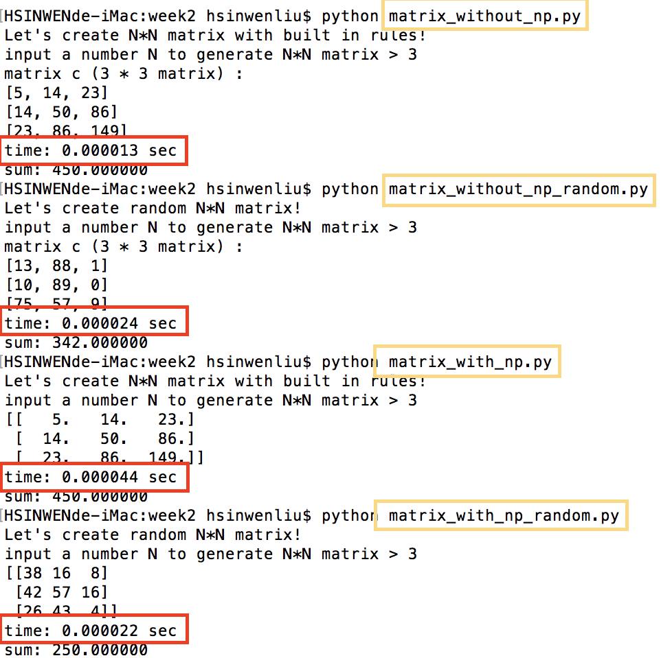

# Description of programs

------

## 1. week2 homework description

**行列積を求めるプログラムを書いて、行列のサイズNと実行時間の関係を調べてみよう仕様：プログラムの入力はサイズNN×Nの行列AとBを用意する（行列の中身は適当でOK）C=ABを計算する（この部分の実行時間を測定する）Nと実行時間の関係をグラフにする（計算量との関係は？）**

**Write code to calculate C = A \* B, where A, B and C are matrices of size N * NMeasure the execution time of your code for various Ns, and plot the relationship between N and the execution time**

--------------------------------------------------------------------------------------------------------------

## 2. programs performance 

### * reference_matrix.py

reference_matric.py is for checking the performace of the program running time and also it print out the sum of  all the values in matrix C.

In the reference code, it assigns some values to matrix A and B follow the following rule:

        A[i, j] = i * n + j (row number * length of row + column number)
        B[i, j] = j * n + i (column number * length of column + row number)
reference sample code : https://github.com/xharaken/step2015/blob/master/matrix.py

and the performace of this program is shown in Fig.1

****[ Fig.1: reference_matrix.py performance for N = 3, N = 4, N =5 : ]****

### * matrix_with_np.py, matrix_without_np.py

**matrix_with_np.py** : check performance using python's package, numpy

**matrix_without_np** : check performace without using python's package 

Fig.2 shows that the program without using numpy is around three times faster than the one using numpy.

Python is a high-level language and it supports many built-in functions and fundamental package that you can use in your program. However, when it comes to evaluate the performance, it is hard to tell how the performace is of your program if you use python's package. Fig.2 shows that the running time  without using numpy is faster than the one using numpy.

**(the running time performance of the program without using numpy depends on how i wrote the multiplication function in function.py —> different way may cause different running time —> i think this question is really interesting: How to make my program execute faster ? )**

****[ Fig.2: performance comparison : ]****

### * matrix_with_np_random.py, matrix_without_np_random.py

**matrix_with_np.py** : check performance using python's package, numpy, with same matrix generation rule in reference_matrix.py 

**matrix_without_np** : check performace without using python's package, with same matrix generation rule in reference_matrix.py 

**matrix_with_np_random.py** : check performance using python's package, numpy, and generate the matrix using random numbers ( 0 < num< size of matrix: n*n)

**matrix_without_np_random** : check performace without using python's package, and generate the matrix using random numbers ( 0 < num< size of matrix: n*n)

Fig.3 shows that program without numpy's running time is faster if the matrix is generate by some rules, however, if the matrix is generater randomly, it's hard to compare the running time through different programs becase matrix a & b are generate randomly, which means the result of matrix c will be different. In Fig.3, if the matrix values are generate randomly, the program matrix_with_np runs faster than the one without using numpy.

****[ Fig.3: performance comparison of the matrix generation method : ]****

### * functions.py

this program called in matrix_without_np.py and matrix_without_np_random.py

functions.py contains two functions:

**multiplicaiton** : calcuate the multiplication of two matrix (not neccessary to be two N*N matrix)

**print_matrix** : print the matrix row by row to print out the matrix like mathematically form

