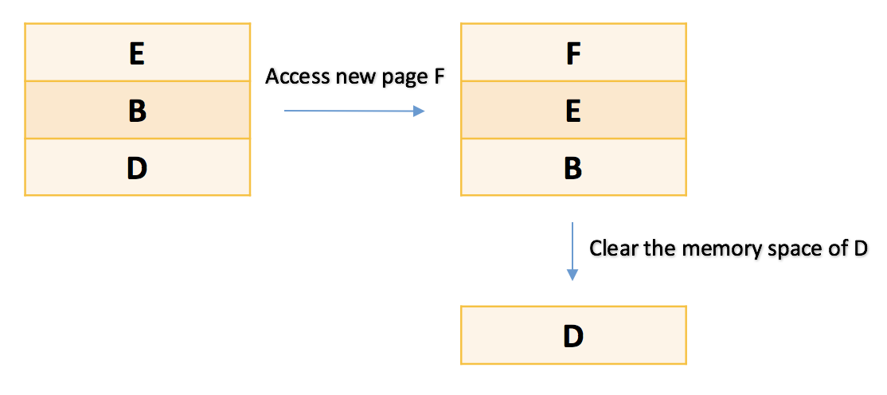
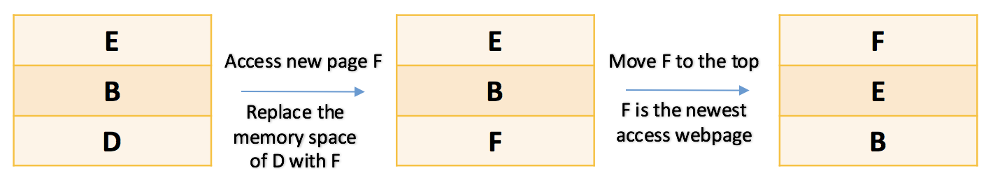
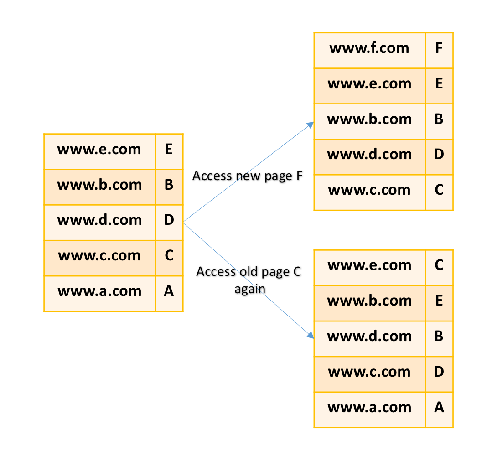
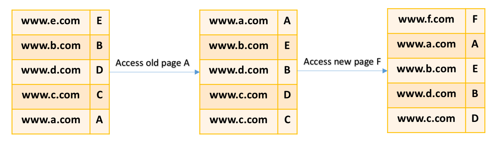

**Liu, Stephanie, Hsin-Wen**

**Google STEP homework — second week June 3rd**

***

**宿題その1**

***

**行列積を求めるプログラムを書いて、行列のサイズNと実行時間の関係を調べてみよう**

**Write code to calculate C = A \* B, where A, B and C are matrices of size N * NMeasure the execution time of your code for various Ns, and plot the relationship between N and the execution time**

***

GitHub URL: https://github.com/Stephanie1125/googlestep/tree/master/week2

Please check  [week2_hw.py](https://github.com/Stephanie1125/googlestep/blob/master/week2/week2_hw.py "week2_hw.py") for graphing program of the relationship between N=0 to 100 and the program execution time. Also please check the [README.md](https://github.com/Stephanie1125/googlestep/blob/master/week2/README.md "README.md") for more details of the matrix programs in [My Github](https://github.com/Stephanie1125/googlestep/tree/master/week2 "mygithub") of week two's homework-1. 

Programs are all mainly written in python3. (may add some programs written in some other programming languages for practicing new skills afterward)

***

**宿題その2**

***

**木構造を使えばO(log N)、ハッシュテーブルを使えばO(1)で検索・追加・削除を実現することができて、これだけ見ればハッシュテーブルのほうがはるかに優れているように見える。ところが、現実の大規模なデータベースでは、（もちろんいろいろなものがあるが）ハッシュテーブルではなく木構造が使われることが多い。その理由を考えよ。**

**The complexity of searching / adding / removing an element is O(1) with a hash table, whereas the complexity is O(log N) with a tree. This means that a hash table is more efficient than a tree. However, large-scale database systems used in a real world tend to prefer a tree to a hash table. Consider reasons why a tree is more preferred than a hash table for those database systems.**

***

​	Usually for evaluation of one's program, we will consider about two parts, first is the program execution running time and the second part is the memery space. As for hash table, you have to build the initial hash table with the approximate size of the input data you may have to use in your program. If the hash table you built doesn't have enough space for storing data, you have to rebuild and resize the table again and all the elements you first put in your first table should be rehashed again and it will take O(n) time, it depends on the size of your input data. 

​	For example, I first build a hash table with size of 10 and i put number 0~ 9 in my hash table (the space is full) and then i want to add element number 10 into my hash table, I have to rebuild another hash table with size 11 and rehash the number 0 ~ 10 into my new hash table, which takes O(n) if the time in this case (adding/ insertion).  On the other hand, for tree data structure, you don't have to know the size of the input data in advance.

​	Also, hash function may have highly chance to map the data into the same hash table index if we have large amount of input data. We will use array of linked list to connect the data in the same index. In this case, it will take O(n) to insert the data in the same index which may already have some data stored in it. (you have to add the data at the end of the array linked list to one index in the hash table), same idea for the removing data case. Not to mention that for using the hash table, data stay unsorted, so for the searching part, you have to go through all the data in the array linked list in order to find the one data you want to search after you know which index number it supposes to be in the hash table, which will take O(n) time. On the other hand, tree structure's data is sorted in some rule (go right if the data is larger than the root and go left if it is smaller than the root), it will take O(log N) in the case of binary search tree on the average.

​	As a result, if we consider the problem that hash table may have if it is a large scale database system, a tree is more preferred than a hash table because that for execution running time O(log N) is much faster than the O(n), also if we consider about the memory space, the space for tree data structure is the same as the data numbers, and for the hash table, we may have to use more space to build the initial hash table to avoid the case that you have to rebuild a new hash table.

***

**宿題その3 (余裕がある人のみ）**

***

**キャッシュの管理をほぼO(1)で実現できるデータ構造を考えよ**

**キャッシュには、もっとも直近にアクセスされた上位X個のの組が保存されるようにする**

**つまり、以下の操作がほぼO(1)で実現できるようなデータ構造を考えよ**

**1. 与えられた (URL, webpage) があるかないかを検索する**

**2. もしない場合、キャッシュ内で一番古いを捨てて、かわりに与えられたを追加する**

**Design a cache that achieves the following operations with O(1) When a pair of (URL, webpage) is given, find if the given pair is contained in the cache or not. If the pair is not contained, insert the pair into the cache after evicting the least recently accessed pair**

***

​	Before we talk about the idea I have in my mind, I want to do a brief summary for the cache part I learned in the STEP class. Here is the example given in class: 

If you want to choose three pages to save in the cache, which will you choose?

Pages browsing history (Webpage A, B, C, D, E….etc ):

…., A, A, A, A, B, A, C, D, D, B, B, D, B, E

​	The first thought that came into my mind is that I want to save the last three webpages. Because most of the time I use the searching engine to search for the information that I need to solve the problems I am currently facing to. For example, I had some trouble installing and setting up the numpy packege for Python3 because all the setup of numpy is already exist in the Python2.7 files. What do I do? 

​	I Googled! I checked more than 10 webpages to solve my problems. Just like the case of webpage A, I opened it so many times in order to solve the problem I have in the past. But after I solved the problem, I don't need to access to the wegpage again because the problem is solved. And then when I look at the Pages browsing history, I noticed that the lasted and most frequently use pages for this user is Page D and Page B and he/she also open a new E page in this browser. As a result, if I am the designer of this cache program, I will save the **page D, B, E** for my user as I assume that he/she is facing some problems that need to access these three pages to solve it or I can say that he/she is interesting to some topic inside these pages. For me, if i want to make my program to be more convinient to the user, I might design another program to see and compare these pages' similarity (Are they topic-related?) If they are related in some field, I might recommend them some webpages in the same or similar topic that have high-page-view or high-page-rate to other users. But how to impliment this method? —> that is another thing that I have to think about it in detail afterward but it is not the topic for today.

​	Go back to the topic, I think in the real life, it's hard to know every algorithms to solve problems and also time past so fast and technology grows very fast too. For me, I think the learning of past algorithm is very good and important because you can stand on the shoulder of giants and then after that you should think about new algorithm if the old one does't fit or satisfied your needs.(But maybe the new algorithm in your mind is actually an old algorithm for someone else —> that is also why we need the Internet and Searching engine). 

Here is the algorithm that may be wise to choose webpages to save in the cache. 

1. **we saved the latest three webpages.**
2. **if the user access new page, we refresh the cathe and save the new one.**

For example,

in the previous example, we first save the page:  **D, B, E** 

if the user open a webpage, F —> we save **B, E, F** instead.

Here is the two methods I have in my mind and I think that may satisfied the result we want.

(1) this is a First In Last Out algorithm. (Sadly, I only know about Stack(LIFO) and Queue(FIFO))

the idea is that we add new item at the end of the cache list and then we pop the item at the begin of the list. In Python, we use ```list.append(F)``` and ```list.pop(0)```. I think this may used more memory space because you still have to save the D in the some of your memery space in your computer, just it is not inside your list. Here is the image of the first idea. after you do ```list.pop(0)``` it will return the removed element which is D in this case.   



(2)  this don't required more memory space because we replace the memory space that saved page D with the information of page F. But in this case it might cause some extra running time because we have to move the new saved page to the end of out list. This is the main problem of this idea, how to move the item in the most efficient way using programming language. In Python, the first step to replace the element, we may use ```list[0]='F'```. and for the moving the begin index to the end of the list, I am thinking that I can use ```list.remove(F)``` and ```list.append(F)```. We first remove the new saved webpage and then add it again to the list like the image below.





***

Up here is the things I have in mind after the second lecture, hope I can recieve some feedback :)

***

So the keypoint in this homework 3 is about designing a cache that achieves the operations with O(1) time. And here is the image I draw for the question.



(1) we first search if the (URL, webpage) is inside the dictionary. ( not really neccsary to move the item to the top because it is a dictionary not a list. In the graph I move the C webpage to the top for easier understanding that this moved to the newest access page)

(2) However, we have to remove the oldest item in order to add new (URL, webpage) item. The problem is: **How do I know which one is the oldest if we don't really care about the order inside the dictionary?**

if it is the case that not adding new element inside the dictionary, we can use hash table to achieve the O(1) time for searching .

So the main problem I met in this question is that, what happen and how to achieve the O(1) for removing the oldest element and add the lastest one inside the dictionary? 

Of course that if we take these two cases independently. we can do something like this:

```
dict = {"www.a.com":"A","www.e.com":"E","www.b.com":"B","www.d.com":"D","www.c.com": "C"}
del dict["www.a.com"] 
# we will know that the first element inside the dict is the oldest.
```

But what if the case we first access page A and then we access new page F, the case will be like this:

at the end instead of removing the (www.a.com, A), which we think might be the oldest one, we have to remove the  (www.d.com, D). 

How to deal with this is we have large amount of data and we refresh the table several times in a day? 

Building a dictionary or table will make achievement to make the operations to be constant time O(1) but the unsolving problems remain. 





***

**ここまで考えたけどわかんなかった …**

**こんなに長々と書くつもりはなかったのですが、ごめんなさい (￣.￣)+**

***


