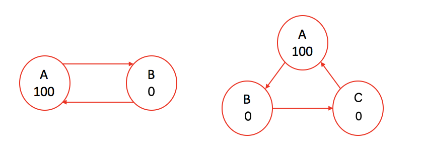

# Description of programs

***

## 宿題その1

***

**ページランクを実装してみましょう先ほどの人間関係のグラフを、簡単に読める形式にして [ここ](https://github.com/Stephanie1125/googlestep/tree/master/week4/sample_inputs) に上げておきます。 medium_data.txt がさっきのデータです。C言語だとhashmap的なデータ構造のライブラリがないので、ちょっと面倒度がアップしますが、たぶん書ける範囲だと思います。 できればのあるC++の方がおすすめですPythonとかRubyとかが楽でおすすめです**

**Implement the pagerank algorithm. Here’s [the sample inputs](https://github.com/Stephanie1125/googlestep/tree/master/week4/sample_inputs) you can use, including the relation graph in the previous slide (medium_data.txt).I recommend to use a laguage which has map/hashmap/dict or something like that -- specifically, like Python, Ruby. Implementing in plain C language might be a bit difficult because of the lack of these data structures, though it’s not impossible. Probably you can use C++ and  instead.**

***

### 1. [week4_hw.py](https://github.com/Stephanie1125/googlestep/tree/master/week4/week4_hw.py)

This program implement the pagerank algorithm. 

Here is the results after apply the pagerank algorithm for the sample inputs:

**small_data.txt:**

{'A': 107.6904296875, 'C': 107.6934814453125, 'B': 107.6934814453125, 'E': 107.6934814453125, 'D': 107.6904296875, 'G': 107.6934814453125, 'F': 53.84521484375}

**medium_data.txt:**

{'A': 154.74673651634293, 'C': 71.02600282687864, 'B': 168.1745165891389, 'E': 227.08369351519087, 'D': 147.98537865099865, 'G': 113.87098039721613, 'F': 136.15754968250545, 'I': 112.02612016726884, 'H': 34.68302376483891, 'K': 149.79394048317238, 'J': 138.7283606138534, 'M': 74.61994704609143, 'L': 79.98298815955457, 'O': 159.96503075089967, 'N': 159.63378439798112, 'Q': 39.99009045083393, 'P': 90.58747558393617, 'S': 140.85283191429613, 'R': 39.9944740000995, 'U': 0, 'T': 60.09707420950684, 'W': 1.862645149230957e-07, 'V': 9.313225746154785e-08}

**large_data.txt:** 

This is too long to put in this README.md file, please check the result output from [week4_hw.py](https://github.com/Stephanie1125/googlestep/tree/master/week4/week4_hw.py).

***

## 宿題その2

***

**このページランクアルゴリズムは、繰り返しを無限に行えば必ず収束しますか？もし収束しないなら、どういう解決策が考えられますか？（1,2 行で十分です）**

**Does the pagerank algorithm I described converge always? If not, what can we do to make sure it converge?**

***

The pagerank algorithm will not converge always in all cases and the following is some examples cases that won't converge no matter how long the process of PageRank algorithm is running.

We can tell that the cases are all form infinite loops or cycles. As a result, to make sure the model we apply converge, we should avoid infinite loops and cycles or we should assign the same values to every nodes. The upper example will converge if we assign 100 to all nodes.

***

**実際にこのページランクアルゴリズムを使うとして、繰り返しはどのぐらいで止めるべきでしょうか？ （実用上はもちろん無限に繰り返すということはできないので、どこで止めるかという判断が必要になります）（1,2 行で十分です）**

**When you use this algorithm in practice, you need to decide when to finish the iteration. How do you decide it?**

***

We finish the iteration process when the model is converge, which means that all nodes will have the same/similar scores as its previous scores. As a result, we can compare scores for each process with its previous result, if two processes scores for every nodes are the same/similar, it means the model is converge and we can finish the iteration process.

***

