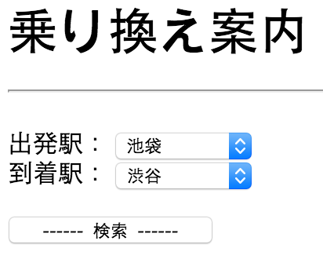
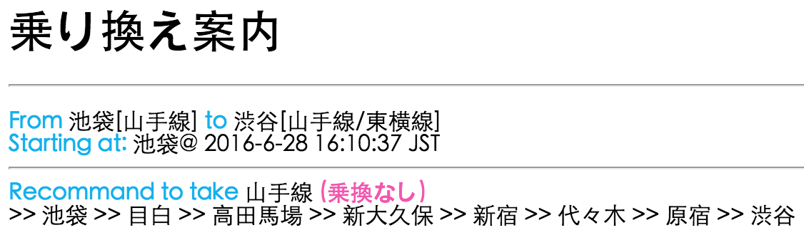

# Description of programs

***

## [liuweek5hw1](https://github.com/Stephanie1125/googlestep/tree/master/week5/liuweek5hw1)

**implement [パタトクカシーー](http://fantasy-transit.appspot.com/pata)**

Please visit the following URL and enjoy the application:

http://liuweek5hw1.appspot.com/

In this application, we input two strings and output the shuffled result of the two strings.

単語をシャッフルするアプリです。

 

***

## [liuweek5hw2](https://github.com/Stephanie1125/googlestep/tree/master/week5/liuweek5hw2)

**implement [train guidance](http://fantasy-transit.appspot.com)**

Please visit the following URL and enjoy the application:

http://liuweek5hw2.appspot.com 

In this application, we input two stations (start station / destination station) and output the path with the least transfer times. (乗換案内少ない順)

乗換案内のアプリです。

  

***

