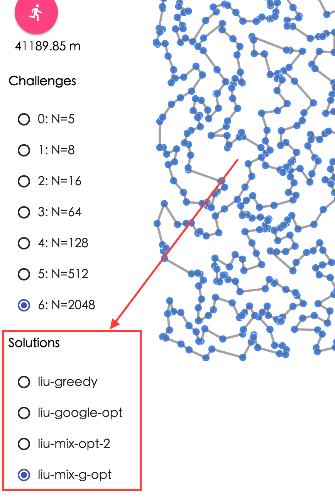

# Description of programs

1. **[solver_all_liu.py](https://github.com/Stephanie1125/googlestep/blob/master/week6/liuweek6tsp/solver_all_liu.py)**

   Try all possible path and calculate all the distances and find the minimum distance.

   Only work for small tsp_size(N) —> N=16 not working

   | tsp_size (N) | distance |
   | :----------: | :------: |
   |      5       | 3291.62  |
   |      8       | 3778.72  |

2. **[solver_greedy_liu.py](https://github.com/Stephanie1125/googlestep/blob/master/week6/liuweek6tsp/solver_greedy_liu.py)**

   Similar with the program [solver_greedy.py](https://github.com/Stephanie1125/google-step-tsp/blob/gh-pages/solver_greedy.py) but we start with the shortest distance path

   | tsp_size (N) | distance |
   | :----------: | :------: |
   |      5       | 3418.10  |
   |      8       | 3832.29  |
   |      16      | 5843.91  |
   |      64      | 10187.55 |
   |     128      | 12465.05 |
   |     512      | 25404.24 |
   |     2048     | 44508.50 |

3. **[solver_google_opt.py](https://github.com/Stephanie1125/googlestep/blob/master/week6/liuweek6tsp/solver_google_opt.py)**

   using google API (google or_tools)

   want to check the result obtained from google TSP 

   cheated : P —> just for fun :)

   | tsp_size (N) |     distance     |
   | :----------: | :--------------: |
   |    **5**     |   **3291.62**    |
   |    **8**     |   **3778.72**    |
   |    **16**    |   **4494.42**    |
   |      64      |     8617.57      |
   |     128      |     11080.74     |
   |     512      |     20867.96     |
   |     2048     |     41207.31     |
   |  4,194,304   | runtime too long |

4. **[solver_opt_2.py](https://github.com/Stephanie1125/googlestep/blob/master/week6/liuweek6tsp/solver_opt_2.py)**

   apply opt_2 algorithm

   | tsp_size (N) |  distance   |
   | :----------: | :---------: |
   |    **5**     | **3291.62** |
   |    **8**     | **3832.29** |
   |      16      |   4670.27   |
   |      64      |   9543.28   |
   |     128      |  11922.39   |
   |     512      |  22722.04   |
   |     2048     |  44508.50   |

5. **[solver_or_opt.py](https://github.com/Stephanie1125/googlestep/blob/master/week6/liuweek6tsp/solver_or_opt.py)**

   apply or_opt algorithm

   | tsp_size (N) |  distance   |
   | :----------: | :---------: |
   |    **5**     | **3291.62** |
   |    **8**     | **3778.72** |
   |    **16**    | **4494.42** |
   |      64      |   9735.26   |
   |     128      |  14302.96   |
   |     512      |  27626.93   |
   |     2048     |  56982.68   |

6. **[solver_mix_opt.py](https://github.com/Stephanie1125/googlestep/blob/master/week6/liuweek6tsp/solver_mix_opt.py)**

   apply both opt_2 and or_opt algorithms

   | tsp_size (N) |  distance   |
   | :----------: | :---------: |
   |    **5**     | **3291.62** |
   |    **8**     | **3778.72** |
   |    **16**    | **4494.42** |
   |      64      |   9445.80   |
   |     128      |  11253.67   |
   |     512      |  21749.24   |
   |     2048     |  42801.43   |

7. **[solver_mix_opt2.py](https://github.com/Stephanie1125/googlestep/blob/master/week6/liuweek6tsp/solver_mix_opt2.py)**

   use the path obtained from **[solver_greedy_liu.py](https://github.com/Stephanie1125/googlestep/blob/master/week6/liuweek6tsp/solver_greedy_liu.py)** as initial input path and then apply both opt_2 and or_opt algorithms on the initial path

   Yeah :)  this method beat the **[solver_google_opt.py](https://github.com/Stephanie1125/googlestep/blob/master/week6/liuweek6tsp/solver_google_opt.py)** for input_3.csv !!!

   | tsp_size (N) |     distance     |
   | :----------: | :--------------: |
   |    **5**     |   **3291.62**    |
   |    **8**     |   **3778.72**    |
   |    **16**    |   **4494.42**    |
   |    **64**    |   **8403.53**    |
   |     128      |     11271.99     |
   |     512      |     20917.76     |
   |     2048     | runtime too long |

8. **[solver_mix_random.py](https://github.com/Stephanie1125/googlestep/blob/master/week6/liuweek6tsp/solver_mix_random.py)**

   use random initail path and then apply both opt_2 and or_opt algorithms on the initial path.

   —> different time will get different result (random)

   —> rewrite the result at solution_6.csv if we get better result

   | tsp_size (N) | distance |
   | :----------: | :------: |
   |     2048     | 42378.64 |


1. **[solver_mix_g_opt.py](https://github.com/Stephanie1125/googlestep/blob/master/week6/liuweek6tsp/solver_mix_g_opt.py)**

   use the path obtained from **google or_tools** as initial input path and then apply both opt_2 and or_opt algorithms on the initial path

   | tsp_size (N) |   distance   |
   | :----------: | :----------: |
   |    **5**     | **3291.62**  |
   |    **8**     | **3778.72**  |
   |    **16**    | **4494.42**  |
   |      64      |   8617.57    |
   |   **128**    | **11080.22** |
   |   **512**    | **20867.06** |
   |   **2048**   | **41189.85** |


***

## Note

For using the visualizer to check the performace:  

1. You can visit this website:

   https://stephanie1125.github.io/liuweek6tsp/visualizer/

2. You can run the program on the local browser:

First, you should download this repository and change to the right directory by running the following command in your Terminal.

```
$ git clone git@github.com:Stephanie1125/googlestep.git
$ cd googlestep/week6/liuweek6tsp/
```

By running the following command, you can check the performances of different programs on the  http://localhost:8000/visualizer/.

```
For Python 3: 
$ ./nocache_server.py 
For Python 2:
$ ./nocache_server.py2.py 
```

[**visualizer**](https://github.com/Stephanie1125/googlestep/tree/master/week6/liuweek6tsp/visualizer), [**nocache_server.py**](https://github.com/Stephanie1125/googlestep/blob/master/week6/liuweek6tsp/nocache_server.py), and [**nocache_server.py2.py**](https://github.com/Stephanie1125/googlestep/blob/master/week6/liuweek6tsp/nocache_server.py2.py) 's copyright are belongs to **[google-step-tsp](https://github.com/Stephanie1125/google-step-tsp)**. 